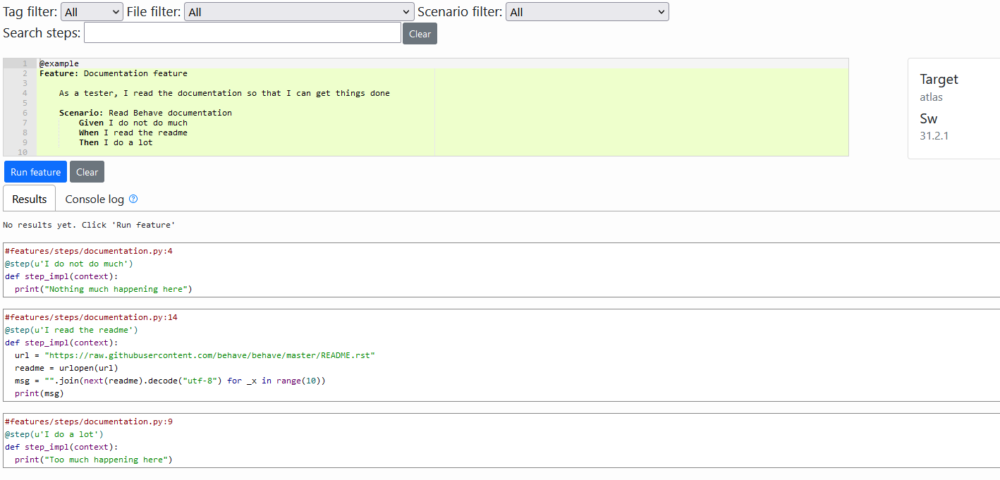

# Behave-Gui - A Behave Front-end

Copyright (c) 2021-present Tomra Systems ASA.

Behave-Gui is a web interface for Python [Behave](https://behave.readthedocs.io/en/stable/). It:
  - displays test step implementations alongside feature files
  - helps you write new feature files by letting you search for existing test step implementations
  - provides a link with search results to go see how existing test step implementations are used in other feature files 
  - lets you run a feature file with a full console log

Behave-Gui is fully compatible with standard Behave folder structures and configuration (features, test steps and configuration files).

## Benefits
  - Being able to see test step implementations alongside test steps makes Behave-Gui a powerful viewer for feature tests used as "living documentation"
  - Behave-Gui is specially suited for "test review", following the same principles as "code review". It presents information relevant to both developers and testers, facilitating collaboration between the two groups
  - Behave-Gui provides an informal environment for editing and developing feature tests suitable for non-technical users uncomfortable with developer IDEs.

## Screenshot


## Dependencies

Behave-Gui requires Python 3 and [Behave](https://behave.readthedocs.io/en/stable/). You can install Behave with this command: 

```bash
python -m pip install behave
```

Behave-Gui also requires [Node.js](https://nodejs.org) for its runtime and for the [npm](https://www.npmjs.com/) package manager.

## Installation

The Behave-Gui top-level folder is divided into two subfolders, `backend` and `frontend`. Execute the following `npm` command in each of the two folders to install:

```bash
frontend$ npm install
backend$ npm install
```

## Configuration
Default configuration options may be overridden if needed in the file `backend\config\default.json`:
```json
{
  "Server": {
    "pythonPath": "python",
    "useSspi": false
  }
}
```
If required, adjust the path to your Python executable in the property "pythonPath"

The option "useSspi" enables [node-sspi](https://www.npmjs.com/package/node-sspi) authentification against Active Directory when Behave-Gui is run on a Windows host.

## Startup

From the `backend` folder, run the following command to start both the front-end and backend:
```bash
npm run startall
```

The above command will alow you to view and run an example test in your web browser at: <http://localhost:3000/?feature=/features/examples/documentation.feature>

## Usage

- You can find test steps used by other features by typing in "Search steps" type-ahead. Click on the black text to copy the step text. Click on the link to open the feature that uses the test step.
- You can use the dropdown boxes to narrow your search.
- You can use intelligent completion within a feature by typing a word and pressing ctrl+spacebar. An auto-complete list will appear with matching steps. The dropdown filters also work with intelligent completion.
- When you edit a file, a save feature button will appear allowing you to save your changes.
- Pressing "Run feature" will execute your feature. You will see log output under the "Console log" tab.
- You can send in url parameters `target` and `sw` which are displayed in the GUI and exposed in Behave via the config.userdata dictionary. See the `-D` option in the Behave [Command-Line Arguments](https://behave.readthedocs.io/en/stable/behave.html?#command-line-arguments) documentation.

## Integrate with your own repo

You can delete the example Behave ```features``` folder in this repo and replace it with the ```features``` folder from you own repo like this:
```
git clone https://github.com/behave-contrib/behave-gui.git
cd ./behave-gui/backend
rm -fr ./features
ln -s ~/myrepo/features/
```

By this simple means you can view your features alongside their step implementations using behave-gui. Note: for this to work, you may need to install behave@1.2.7 directly from github to overcome issue #675: Feature files cannot be found within symlink directories (provided by: smadness, pull #680). See [CHANGES.rst](https://github.com/behave/behave/blob/main/CHANGES.rst)

## Troubleshooting
If step definitions fail to load and you see an error like the following at the console, you need to set the path to your Python 3 executable in `backend/config/default.json` (see 'Configuration', above):
```bash
backend/runFeatures.py", line 2, in <module>
    import configparser
ImportError: No module named configparser
```

## Contributing
Pull requests are welcome. For major changes, please open an issue first to discuss what you would like to change.

## License
[MIT](https://choosealicense.com/licenses/mit/)